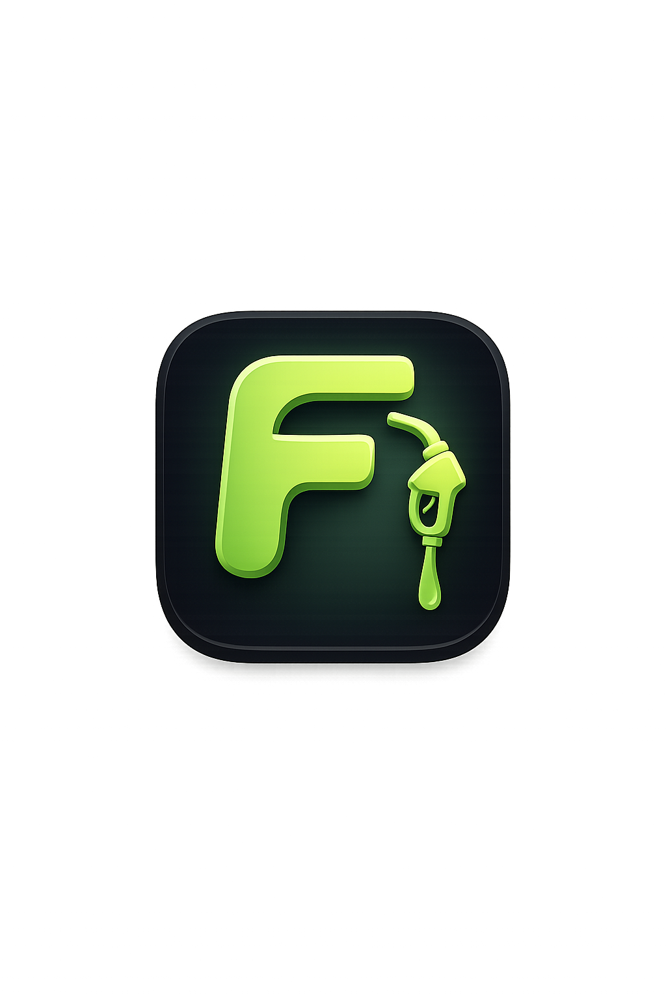
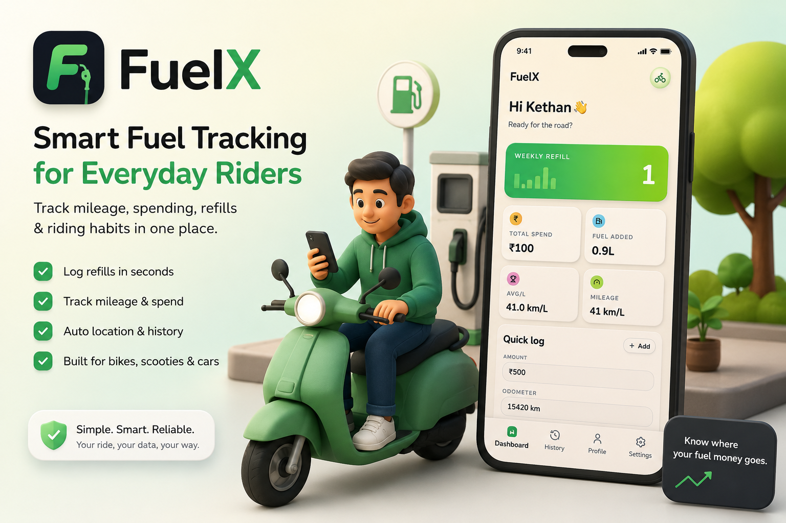
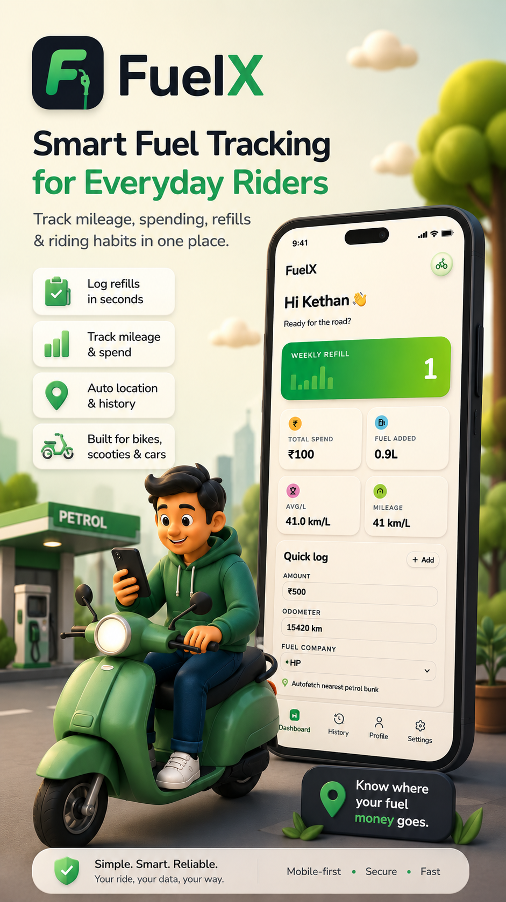
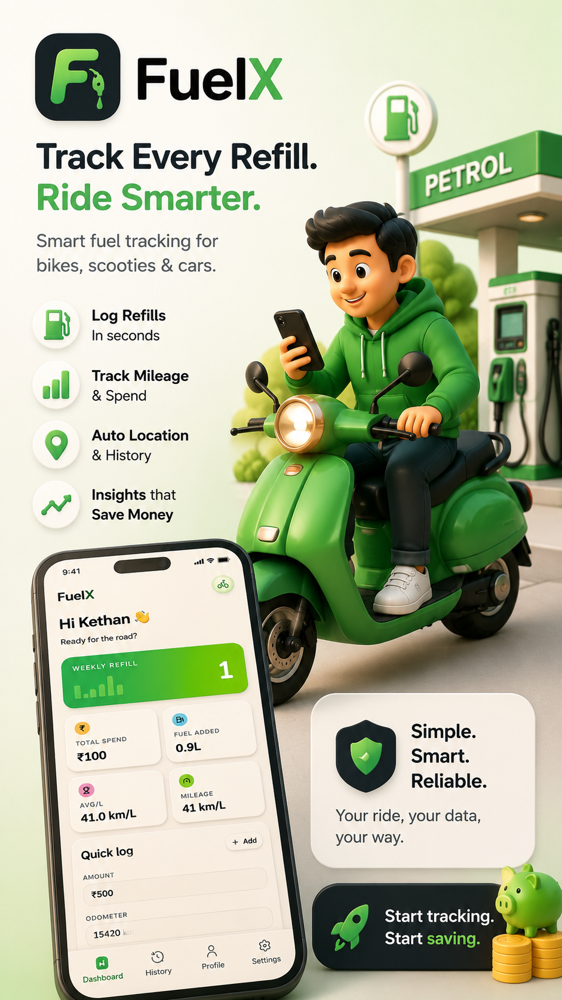

  
  <h1>⛽ FuelX</h1>
  
<strong>Smart fuel tracking for everyday Indian riders.</strong>

  
<em>Track every refill. Know your mileage. Own your data.</em>

  
  
  

---

---

## 📌 Overview

FuelX is a mobile-first full-stack web application designed for everyday Indian riders who want to take control of their fuel expenses and riding habits.

Most riders track fuel on WhatsApp, notes apps, or just don't track at all — which means zero visibility into where fuel money actually goes every month. A typical Indian rider loses ₹2,000–₹4,000 per year purely from not tracking fuel efficiently.

**FuelX solves that in three steps:**

1. **Log** — Add a refill in seconds: fuel company, amount in rupees, odometer reading
2. **Calculate** — FuelX auto-computes your km/l mileage after every fill
3. **Analyse** — View your weekly spend, fuel patterns, and riding trends in a clean dashboard

Built with a production-grade architecture — Docker-containerized, CI/CD via GitHub Actions, deployed on a VPS behind Traefik, and also live on Vercel. Not a tutorial project. A real, shipped product.

---

## 🌐 Live

| Environment | URL |
|---|---|
| 🟢 Production | https://fuelx.kethanvr.tech/ |
| ⚡ Vercel Preview | https://fuelx-omega.vercel.app/ |

---

## 🖼️ App Preview

|---|---|
|  |  |

---

## ✨ Features

- **Quick Refill Logging** — Log fuel amount, company, and odometer in seconds
- **Auto Mileage Calculation** — Every refill auto-computes your km/l
- **Weekly & Monthly Analytics** — Visual spend and fuel usage dashboard
- **Fuel Company Defaults** — Smart litre estimates for Shell, BPCL, HPCL and more
  - Shell: 0.807 L per ₹100
  - Others: 0.933 L per ₹100 (editable)
- **Refill History** — Full log with filters by date and fuel company
- **Vehicle Profile** — Store your vehicle name, type, and baseline mileage
- **Location Auto-fetch** — Nearest petrol bunk/area detected automatically
- **Secure Auth** — Email/password login with encrypted sessions and password reset
- **Mobile-First UI** — Sidebar nav, mobile collapse toggle, built for on-the-go use

---

## 🛠️ Tech Stack

| Layer | Tech |
|---|---|
| Frontend | Next.js 16 (App Router), React 19, TypeScript, Tailwind CSS, Framer Motion |
| Database | MongoDB Atlas + Mongoose |
| DevOps | Docker, GitHub Actions CI/CD, Traefik, DigitalOcean VPS |
| Preview | Vercel |

---

## 🔮 Roadmap

- [ ] AI-powered mileage prediction
- [ ] Multi-vehicle support
- [ ] Fuel expense export — PDF / CSV
- [ ] EV support
- [ ] Service & maintenance reminders
- [ ] PWA offline mode
- [ ] Fleet tracking (lite version)

---

## 👨‍💻 About the Developer

  
  <h3>Kethan VR</h3>
  
Full-Stack Developer · ISE @ CMRIT Bangalore (2024–2028)

Passionate about building real-world products that solve everyday problems — not just tutorial projects.

FuelX was built from scratch as a fully production-deployed application: containerized with Docker, shipped via GitHub Actions CI/CD, running on a DigitalOcean VPS behind Traefik, and live on a custom domain.

| | |
|---|---|
| 🌐 Portfolio | [kethanvr.me](https://kethanvr.me) |
| 💼 LinkedIn | [linkedin.com/in/kethan-vr-433ab532b](https://github.com/Kethanvr) |
| 🐙 GitHub | [github.com/Kethanvr](https://github.com/Kethanvr) |
| 🐦 X / Twitter | [@VrKethan](https://x.com/VrKethan) |

---

## 📜 License

MIT — free to use, fork, and build on.

---

  
If this project helped or inspired you, drop a ⭐ — it genuinely means a lot.

  <a href="https://fuelx.kethanvr.tech/"><strong>→ Try FuelX Live</strong></a>

